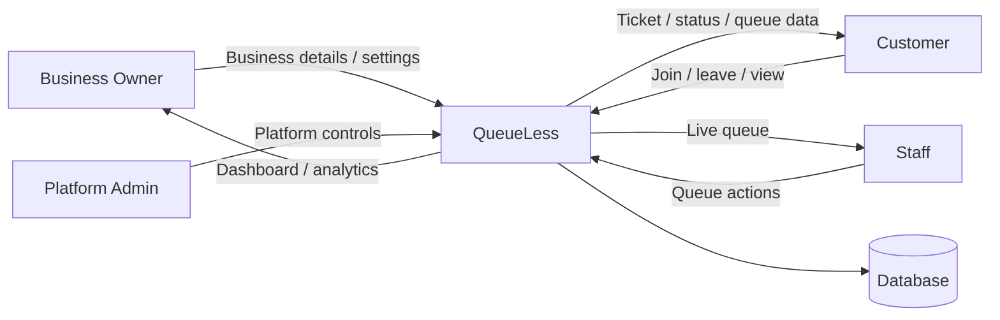
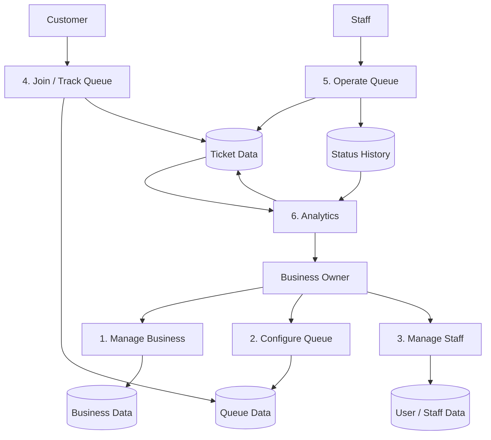
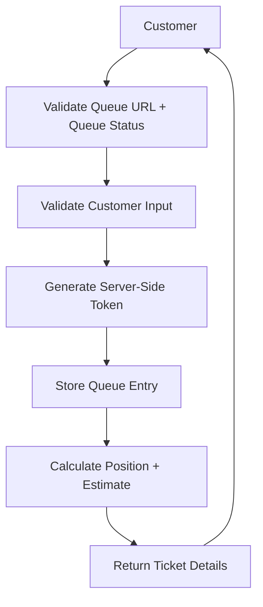
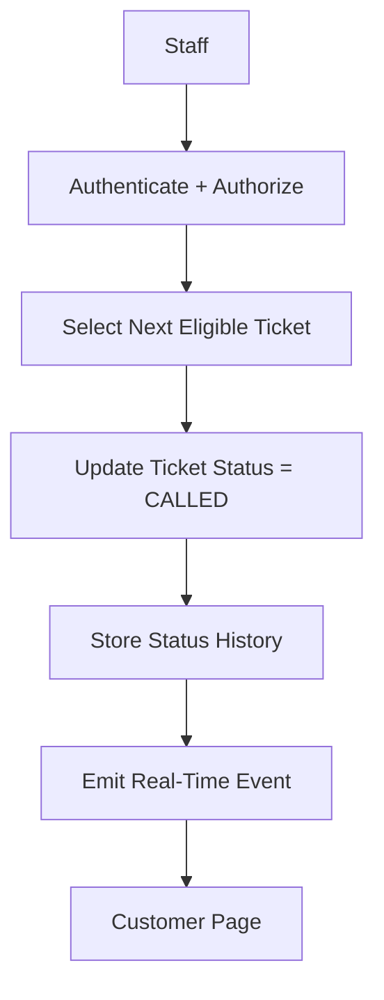

# QueueLess – Data Flow Diagrams

## Level 0 / Context Level

```mermaid
flowchart LR
    BO[Business Owner] -->|Business details / settings| Q[QueueLess]
    ST[Staff] -->|Queue actions| Q
    CU[Customer] -->|Join / leave / view| Q
    PA[Platform Admin] -->|Platform controls| Q
    Q -->|Ticket / status / queue data| CU
    Q -->|Dashboard / analytics| BO
    Q -->|Live queue| ST
    Q --> D[(Database)]
```

## Level 1

```mermaid
flowchart TD
    BO[Business Owner] --> P1[1. Manage Business]
    BO --> P2[2. Configure Queue]
    BO --> P3[3. Manage Staff]
    CU[Customer] --> P4[4. Join / Track Queue]
    ST[Staff] --> P5[5. Operate Queue]
    P1 --> D1[(Business Data)]
    P2 --> D2[(Queue Data)]
    P3 --> D3[(User / Staff Data)]
    P4 --> D2
    P4 --> D4[(Ticket Data)]
    P5 --> D4
    P5 --> D5[(Status History)]
    P6[6. Analytics] --> D4
    D4 --> P6
    D5 --> P6
    P6 --> BO
```

## Level 2 – Join Queue

```mermaid
flowchart TD
    C[Customer] --> V[Validate Queue URL + Queue Status]
    V --> F[Validate Customer Input]
    F --> T[Generate Server-Side Token]
    T --> S[Store Queue Entry]
    S --> W[Calculate Position + Estimate]
    W --> R[Return Ticket Details]
    R --> C
```

## Level 2 – Staff Call Next

```mermaid
flowchart TD
    S[Staff] --> A[Authenticate + Authorize]
    A --> N[Select Next Eligible Ticket]
    N --> U[Update Ticket Status = CALLED]
    U --> H[Store Status History]
    H --> E[Emit Real-Time Event]
    E --> C[Customer Page]
```
